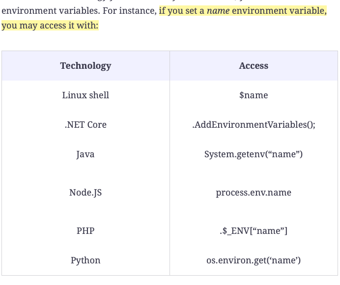

# Docker Cheat Sheet/Notes <a id ='top'></a>

<br>
<br>

# Contents

- [`docker run`](#1)
- [`docker pull`](#2)
- [`docker help`](#3)
- [`docker ps` ](#4)
- [docker logs`](#5)
- [`docker inspect`](#6)
- [`docker stop`](#7)
- [`docker rm`](#8)
- [`docker build`](#9)
- [Dockerfile & .dockerignore](#10)
- [`docker image`](#11)
- [Docker Environment Variables](#12)
- [Persistent Storage: VOLUME](#13)
- [EXPOSE](#14)
- [`docker tag`](#15)
- [`docker login`](#16)
- [`docker push](#17)
- [`docker commit`](#18)
- [`docker network`](#19)
- [`docker exec`](#20)
- [`docker compose commands`](#)
- [](#)
- [](#)
- [](#)
- [](#)
- [](#)
- [](#)
- [](#)
- [](#)
- [](#)
- [bottom](#bottom)
- [go to top](#top)

<br>
<br>
<br>


# `docker run` <a id='1'></a> ([go to top](#top))

  ```
  docker run [OPTIONS] IMAGE-NAME [COMMAND] [ARGUMENT]
  ```

-  Create and run a container based on the hello-world image.

  ```
  docker run hello-world
  ```

- Run a container in the background and print container ID

  ```
  docker run -d IMAGE 
  ```

- ports: Open and listen for connections @ port 8085 on local machine and port 80 on nginx container

  ```
  docker run -d -p 8085:80 nginx
  ```
  - view nginx app at

  ```
  http://localhost:8085
  ```

- Volume Mount: ensure that any data written to the `/var/lib/mysql` directory inside the container is actually written to the `/your/dir` directory on the host system.


  ```
  docker run -v /your/dir:/var/lib/mysql -d mysql:5.7
  ```

- Automatically remove the container when it exits

  ```
  docker run --rm CONTAINER NAME|ID
  ```

- Stop containe with `Ctrl+C` in command line

  ```
  docker run -it CONTAINER NAME|ID
  ```

- restart mode
  - restart mode tells Docker what to do when a container stops. A restart mode is set with the --restart switch.

  ```bash
  docker run -d -p 80 --restart always nginx

  # But if you try to stop the container using the docker stop command, it will not stop. 
  #so use unless-stopped

  docker run -d -p 80 --restart unless-stopped nginx
  ```

- name a container
  ```
  docker run -d --name web -p 8888:80 nginx:1.19.0
  ```

<br>
<br>
<br>

# `docker pull` <a id='2'></a> ([go to top](#top))

```
docker pull [OPTIONS] NAME[:TAG|@DIGEST]
```

- Download and image

  ```
  docker pull IMAGE NAME
  ```

<br>
<br>
<br>

# `docker help` <a id='3'></a> ([go to top](#top))

- See top level docker commands

  ```
  docker help
  ```

- Help wotj amy command add --help

  ```
  docker run --help
  ```

  ```
  docker ps --help
  ```

<br>
<br>
<br>

# `docker ps` <a id='4'></a> ([go to top](#top))

- List currently running containers
```
docker ps
```

- List all containers, running or stopped

```
docker ps -a
```


<br>
<br>
<br>

# `docker logs` <a id='5'></a> ([go to top](#top))c

- See logs for a specific container, even when it has stopped

  ```
  docker logs container NAME|ID
  ```

- See the logs for the laters 10 seconds

  ```
  docker logs --since 10s CONTAINER NAME|ID
  ```


<br>
<br>
<br>

# `docker inspect` <a id='6'></a> ([go to top](#top))

- Get detailed info on a running/stopped container

  ```
  docker inspect CONTAINER NAME|ID
  ```

<br>
<br>
<br>

# `docker stop` <a id='7'></a> ([go to top](#top))

- Stop a running container

  ```
  docker stop CONTAINER NAME|ID
  ```


- wait 5 secodnds before stopping

  ```
  docker stop -t 5 CONTAINER NAME|ID
  ```

<br>
<br>
<br>

# `docker rm` <a id='8'></a> ([go to top](#top))

- Delete a container

  ```
  docker rm CONTAINER NAME|ID
  ```

- Delete all containers/volumes/images which are not in use/running

  ```
  docker container prune -f
  docker container prune -f
  docker volume prune -f
  docker image prune -f
  docker image prune --all
  docker rm  $(docker ps -aq) //   docker rm -f $(docker ps -aq)
  ```

<br>
<br>
<br>

# `docker build` <a id='9'></a> ([go to top](#top))

- A Docker image is created using the `docker build` command and a `Dockerfile file`. The Dockerfile file contains instructions on how the image should be built.
  - The `CMD `instruction specifies which executable is run when a container is created using your image and provides optional arguments.
  - The program to run and its arguments are provided as a `JSON array of strings.`

- A `Dockerfile` based on Debian Linux that displays hello world
  ```
  FROM debian
  CMD ["echo", "Hello world"]
  ```

- To create an image (`named hello`) from my Dockerfile file, run the docker build command in the directory where the Dockerfile file lives:
  - The -t switch is used in front of the desired image. 
  - Images created without a name, would have an auto-generated unique ID, so it is an optional parameter on the docker build command.

  ```
  docker build -t hello .
  ```


<br>
<br>
<br>

# Dockerfile & .dockerignore <a id='10'></a> ([go to top](#top))

- A Dockerfile to create a webserver and serve a webpage over http

  ```
  FROM nginx:1.15
  COPY index.html /usr/share/nginx/html
  ```

- Docker file commands

  ```
  FROM
  ENV
  COPY path-to-file path-inside-image
    COPY ./Project/src/*.ts ./src
    COPY ./Project/package.json . 
    COPY *.java .
  CMD
  EXPOSE
  VOLUME
  RUN
    FROM debian:8
    COPY . .
    RUN apt-get update -y && apt-get upgrade -y && apt-get dist-upgrade -y
    RUN apt-get install -y php5
  WORKDIR
  ENTRYPOINT
  ```


- .dockerignore file

  ```
  # Ignore .git folder
  .git
  # Ignore Typescript files in any folder or subfolder
  **/*.ts
  ```

- [Managing image size](https://www.educative.io/module/page/LgoqGKFl7YxO2wNDm/10370001/5453871022342144/6678973307158528)
  - when using package managers like NPM, NuGet, apt, and so on, make sure you run them while building the image
  - run be fore copy to use cache from first build if files youre copying change
    ```
    FROM debian:8
    RUN apt-get update -y && apt-get upgrade -y && apt-get dist-upgrade -y
    RUN apt-get install -y php5
    COPY . .
    ```

- Multi stage docker files
  -  An image can be named simply by adding` AS `at the end of the FROM instruction. Consider the following simplified Dockerfile file:
    - It defines two images, but only the last one will be kept as the result of the docker build command. The filesystem that has been created in the first image, named builder, is made available to the second image thanks to the --from argument of the COPY command. It states that the /result folder from the builder image will be copied to the current working directory of the second image.
    - You can benefit from the tools available in fat-image while getting an image with only the environment defined in the small-image it’s based on.

  ```
  FROM fat-image AS builder
  ...

  FROM small-image
  COPY --from=builder /result .
  ...
  ```
  ```bash
  FROM microsoft/dotnet:2.2-sdk AS builder
  WORKDIR /app

  COPY *.csproj  .
  RUN dotnet restore

  COPY . .
  RUN dotnet publish --output /out/ --configuration Release

  FROM microsoft/dotnet:2.2-aspnetcore-runtime-alpine
  WORKDIR /app
  COPY --from=builder /out .
  EXPOSE 80
  ENTRYPOINT ["dotnet", "aspnet-core.dll"]
  ```


<br>
<br>
<br>

# `docker image` <a id='11'></a> ([go to top](#top))

- See all local images

  ```
  docker image ls
  ```

- Delete an image

  ```
  docker image rm IMAGE NAME|ID
  docker rmi IMAGE NAME|ID
  ```

- Delete unused images

  ```
  docker image prune
  ```

<br>
<br>
<br>

# Docker Environment Variables <a id='12'></a> ([go to top](#top))

  

- to provide an environment variable’s value at runtime, you simply use the 
  `-e name=value` parameter on the docker run command.
- If the system that runs the container has the name environment variable defined, and you want to reuse it, then you can simply use the `-e name` parameter without specifying a value.

  ```
  docker run -e name=value CONTAINER/IMAGE NAME|ID
  ```
  ```
  name=value
  docker run -e name CONTAINER/IMAGE NAME|ID
  ```

- a default value for an environment variable, in case it isn’t provided when a container is created; this may be done in the Dockerfile file, using the ENV instruction.

  ```bash
  # ping.sh file

  #!/bin/sh
  echo "Pinging $host..."
  ping -c 5 $host
  ```

  ```bash
  # docker file
  FROM debian:8

  ENV host=www.google.com
  COPY ping.sh .
  CMD ["sh", "ping.sh"]
  ```

  ```bash
  ### run teo containers on with a custom variable
  docker run --rm pinger
  docker run --rm -e host=www.bing.com pinger
  ```

<br>
<br>
<br>

# Volumes: Persisitent Storage <a id='13'></a> ([go to top](#top))

- [Volume Documentation](https://docs.docker.com/engine/reference/builder/#volume)

- The `/path/to/directory` is a path to a directory used inside the image. When a container is created using the docker run command, the -v switch can be used to map this directory to an actual volume on the host system.

  ```
  VOLUME /path/to/directory
  ```

- Bind mount a volume 
  ```
  docker run -v
  ```

- Volume Mount: ensure that any data written to the `/var/lib/mysql` directory inside the container is actually written to the `/your/dir` directory on the host system.

  ```
  docker run -v /your/dir:/var/lib/mysql -d mysql:5.7
  ```

- Share files between containers
  ```
  docker run --name new-container --volumes-from existing-container -d -p 8082:80 nginx
  ```


<br>
<br>
<br>

# EXPOSE <a id='14'></a> ([go to top](#top))

- When your image hosts server software, it listens on one or several ports. For instance, an HTTP server generally listens on the TCP port 80. You can make this explicit (in the dockerfile?using an `EXPOSE` instruction:

  ```
  EXPOSE 80
  ```

- USE `-P` PUBLISH ALL flag to dynamically map exposed ports to the host (docker automatically chooses ports)

<br>
<br>
<br>

# `docker tag` <a id='15'></a> ([go to top](#top))

- The docker tag command accepts two arguments; first, the name of an existing image, and second, the name you want to add to that image.
  ```
  docker tag diameter-js temikelani/diameter-js
  ```

<br>
<br>
<br>

# `docker login` <a id='16'></a> ([go to top](#top))

- The docker login command asks for my Docker Hub credentials interactively, but you could also provide them as arguments to the command.

  ```
  docker login [OPTIONS] [SERVER] [flags]
  docker login [command]
  ```
  ```
  docker login
  docker login -u username -p password
  ```

<br>
<br>
<br>

# `docker push` <a id='17'></a> ([go to top](#top))

- The docker push command is smart enough to push only the bits that differ from the base image you used to build your image since it is already stored in the Docker Hub. 

  ```
  docker login
  docker push temikelani/diameter-js
  ```

<br>
<br>
<br>

# `docker commit` <a id='18'></a> ([go to top](#top))

- turn a container into and image

  ```
  docker commit CONTAINER IMAGE|ID NEW_IMAGE_NAME

<br>
<br>
<br>

# `docker network` <a id='19'></a> ([go to top](#top))

  ```
  docker network ls
  ```


<br>
<br>
<br>

# docker exec <a id='20'></a> ([go to top](#top))

- [Docs]https://stackoverflow.com/questions/20932357/how-to-enter-in-a-docker-container-already-running-with-a-new-tty
- Enter a Docker container
  ```
  docker exec -it CONTAINER NAME/ID bin/bash
  docker exec -it CONTAINER NAME/ID bin/sh
  docker exec -it CONTAINER NAME/ID bash
  ```

- if they dont work run docker inspect on the container and search for the CMD command to see what command was used. 

<br>
<br>
<br>

# docker compose commands  <a id='21'></a> ([go to top](#top))

[Educative](https://www.educative.io/module/lesson/docker-compose-for-developers/R1RZGQVMnPV)


<br>
<br>
<br>

# Title <a id=''></a> ([go to top](#top))


<br>
<br>
<br>

# Title <a id=''></a> ([go to top](#top))


<br>
<br>
<br>

# Title <a id=''></a> ([go to top](#top))


<br>
<br>
<br>

# bottom <a id='bottom'></a> ([go to top](#top))

```
export DOCKER_FORMAT="ID\t{{.ID}}\nNAME\t{{.Names}}\nIMAGE\t{{.Image}}\nPORTS\t{{.Ports}}\nCOMMAND\t{{.Command}}\nCREATED\t{{.CreatedAt}}\nSTATUS\t{{.Status}}\n"

docker ps --format=$DOCKER_FORMAT
```
or
```
docker ps --format="ID\t{{.ID}}\nNAME\t{{.Names}}\nIMAGE\t{{.Image}}\nPORTS\t{{.Ports}}\nCOMMAND\t{{.Command}}\nCREATED\t{{.CreatedAt}}\nSTATUS\t{{.Status}}\n"
```

```
docker run -p 8088:8080 jenkins/jenkins:lts
```

```
FROM node:11-alpine

COPY compute.js .

CMD node compute.js
```

```
docker stats
```

``` bash

# Use a Dockerfile to create an image on the Docker host named myapp with tag 0.0.1. Use the busybox image with tag 1.31.1 as the starting point for the image. Configure the image to use the nc -lv -p 5000 as the default command (This command uses netcat to listen for incoming TCP connections on port 5000). Ensure that containers created from the image will listen on port 5000.


FROM busybox:0.0.1
EXPOSE 5000
CMD ["nc -lv -p 5000"]
```

<br>
<br>
<br>

